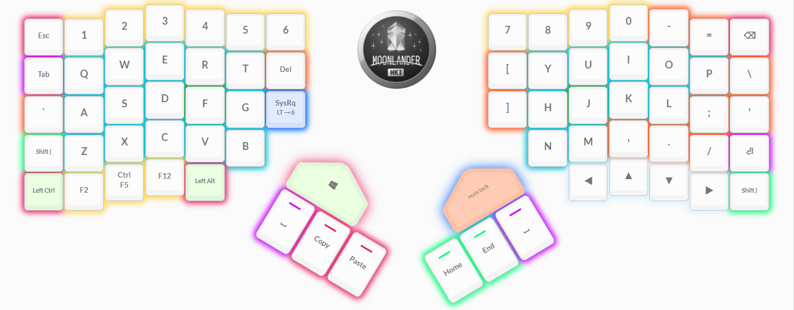
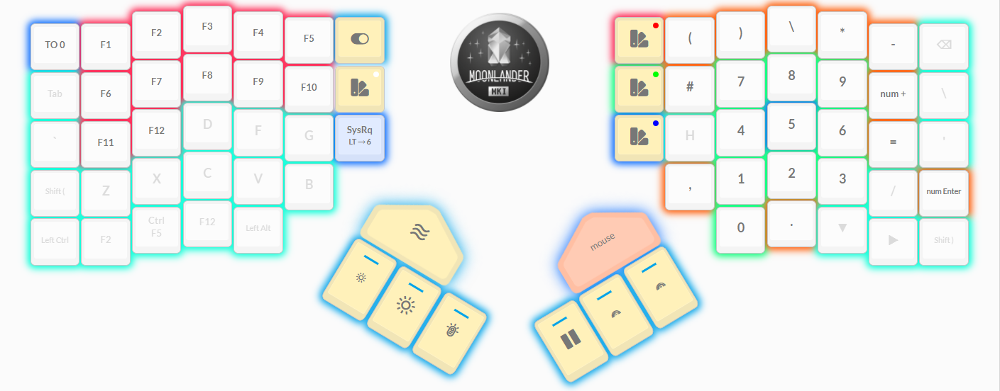
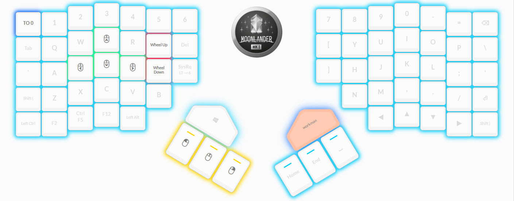
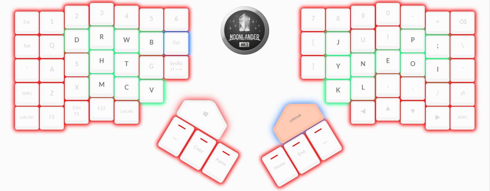
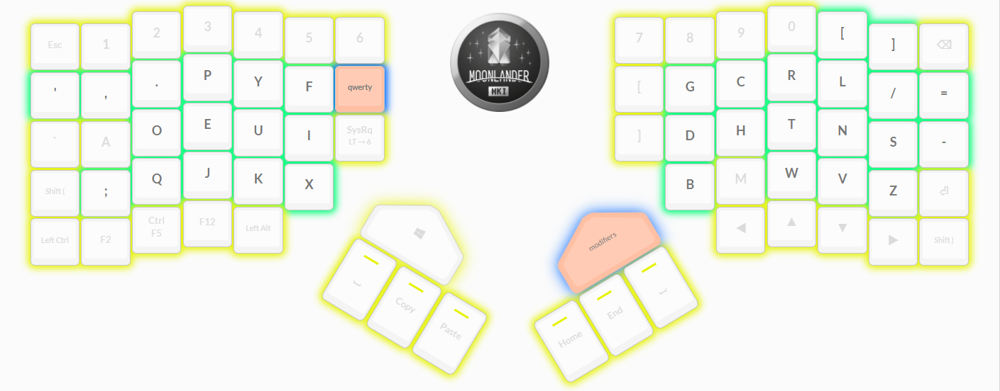
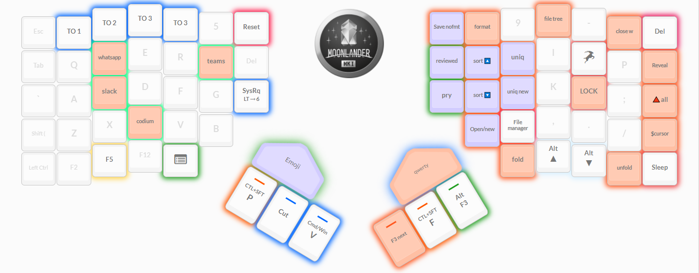

# moonlander-layout

My moonlander keyboard layout. There are 7 layers currently.

Notes
  - Auto shift is turned on.

### Layers

0. Default QWERTY layout
    
    - Notes
      - Left and right `shift` keys use the `Space Cadet` option. Holding the key acts as a shift, tapping works as the corresponding round bracket.
      - I use the 3 function keys on the bottom left a lot, the `F5` key has the Ctrl modifier.
      - `Del` key exists on this layer, and also on the mod layer.
      - `SysRq` is a combo, on tap it is Print Screen, hold activates the mod layer.
      - The right trigger key moves to layer 1 "Number pad".
1. Number pad and LED control
    
    - Notes
      - This layer may change, some of the arithmetic keys are odd.
      - Basic LED color controls on this layer, mostly just for demos. May remove them in the future.
      - `Esc` key goes directly back to layer 0.
2. Mouse control
    
    - Notes
      - Mouse movement and button keys. Haven't used this as it isn't as precise as I need. May remove in the future.
      - `Esc` key goes directly back to layer 0.
3. Workman layout
    
    - Notes
      - Slowly switching to this layout, will swap with QWERTY at some point.
      - `Esc` key goes directly back to layer 0.
4. Colemak layout
    
    - Notes
      - This is here as a trial, workman seems better for now.
      - `Esc` key goes directly back to layer 0.
5. Dvorak layout
    
    - Notes
      - This is here as a trial, workman seems better for now.
      - `Esc` key goes directly back to layer 0.
6. Modifiers, shortcuts, and Codium commands
    
    - Notes
      - Quick links to the different layers. It is a bit awkward to hit the shortcuts on the left hand side unless using your thumb on the modifier key.
      - Left hand is for shortcuts to apps that I regularly open but don't always want running constantly.
      - `F5` here is without the Ctrl modifier.
      - Orange highlighted keys are for Codium (VSCode).
      - `Reset` is for resetting the keyboard when flashing new layouts.
      - `Sleep` is to put the computer to sleep.
      - The up and down arrow keys on this layer have the Alt modifier.
      - `Esc` key goes directly back to layer 0.

## Files

 - Files in the [wally](wally) folder are for use with the a wally app.
 - TODO: Add the script to convert from the keymap.c to a json file for use with the [QMK UI tool](https://config.qmk.fm/).

## Links
- [Edit this layout with Oryx](https://configure.ergodox-ez.com/moonlander/layouts/l7vJM/latest/0)
- [More about the keyboard](https://www.zsa.io/moonlander/)
- [QMK UI tool](https://config.qmk.fm/)

## Building your layout from source (from the Oryx export)

- Use the [documentation](https://docs.qmk.fm/) to set up your environment for building your firmware.
- Build your layout against [our QMK fork](https://github.com/zsa/qmk_firmware/) instead of qmk/qmk_firmware. This is what Oryx (the graphical configurator) uses, so it's guaranteed to work.
- Create a folder with a simple name (no spaces!) for your layout inside the qmk_firmware/keyboards/planck/keymaps/ folder.
- Copy the contents of the \*\_source folder (in the .zip you downloaded from Oryx) into this folder.
- Make sure you've set up your environment per the [QMK docs](https://docs.qmk.fm/#/newbs_getting_started?id=set-up-your-environment) so compilation would actually work.
- From your shell, make sure your working directory is qmk*firmware, then enter the command `make planck/ez:_layout_`, substituting the name of the folder you created for "_layout_".
 - You can always get back to your [original layout](https://configure.ergodox-ez.com/moonlander/layouts/l7vJM/4aBxd/0) from Oryx.
